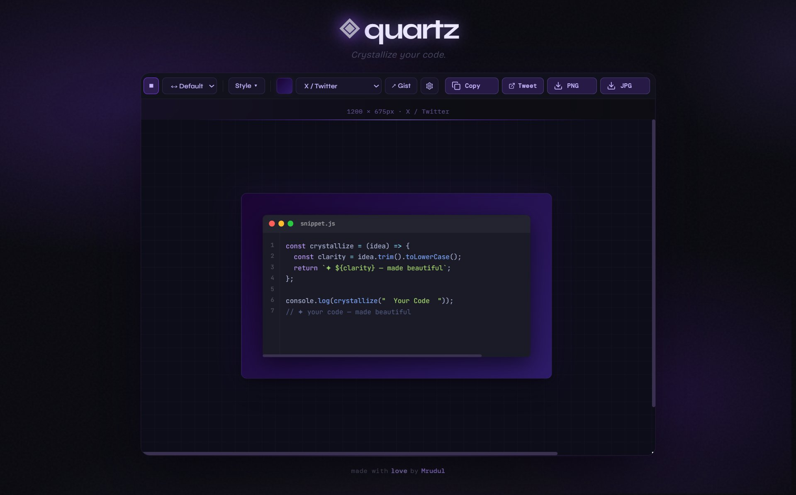

# ◈ Quartz

> **Crystallize your code.**

Quartz is a code-to-image tool I built because I was tired of carbon.now.sh looking the same as everyone else's screenshots. I wanted something with a real design identity — dark, violet, editorial — and a few features that none of the existing tools have.

Paste your code, pick a theme, export a pixel-perfect image. That's it.

**[quartz](quartz-theta.vercel.app)** &nbsp;·&nbsp; Built by [Mrudul](https://github.com/Mrudul1234)

---



---

## Why I built this

Every developer has posted a code screenshot at some point. Carbon is the go-to, but the exports always look a bit generic. Ray.so is cleaner but locked into their aesthetic. I wanted something I actually liked looking at — so I built Quartz over a few weeks, iterating on the design until it felt right.

The violet nebula background, the glassy card, the Cal Sans logo — all deliberate. It's a tool I use myself when I post code on LinkedIn or Twitter.

---

## Features

### 35 Syntax Themes
VS Code Dark+, Dracula, Monokai, Tokyo Night, Catppuccin Mocha, Catppuccin Latte, Nord, GitHub Dark, GitHub Light, Gruvbox, Night Owl, Horizon, Rosé Pine, Kanagawa, Synthwave '84, Poimandres, Ayu Dark, Vesper, Cobalt2, Shades of Purple, Palenight, Andromeda, Bearded Arc, Moonlight, Everforest Dark, Ayu Mirage, Dracula Soft, Plastic, Quiet Light, Solarized Light, Houston, and more.

All themes are searchable — just start typing in the dropdown.

### 9 Card Style Presets
The outer card frame has 9 visual styles:

| Style | Description |
|---|---|
| **Gradient** | Default violet-to-deep-purple gradient |
| **Frosted Glass** | Semi-transparent blur + transparency |
| **Neon Outline** | Dark background with glowing violet border |
| **Minimal Flat** | Clean `#111118` — no gradients, no noise |

### GitHub Gist Import
Paste any public Gist URL and Quartz fetches the code, filename, and language automatically. No copy-paste needed. Supports `gist.github.com/username/id` format — no auth token required.

### Platform-Sized Exports
Pick your platform and the canvas resizes to the correct dimensions:

| Platform | Size |
|---|---|
| X / Twitter | 1200 × 675px |
| LinkedIn | 1200 × 627px |
| Instagram Square | 1080 × 1080px |
| Instagram Story | 1080 × 1920px |
| YouTube Thumbnail | 1280 × 720px |
| OG Image | 1200 × 630px |
| Custom | Anything you want |

### Pixel-Perfect PNG Export
The export engine bypasses html2canvas for the code content entirely — instead it uses the Canvas 2D API directly, drawing each syntax token at its exact X position using `ctx.fillText()`. This is the same approach Ray.so uses and it means zero overlap, zero text cutting, zero blurry fonts. Every export comes out at 2× resolution (retina-ready).

### Shareable URLs
Every setting — theme, language, font, platform, padding, border radius, line numbers, shadow, card style — is encoded into the URL. Copy and share a link and it opens in exactly the same state. Useful for saving presets or sharing configurations with teammates.

### Adjustable Everything
- **Font size** — slider from 12px to 20px
- **Padding** — how much breathing room around the code
- **Border radius** — from sharp corners to very rounded
- **Line numbers** — toggle on/off
- **Window frame** — toggle the VS Code chrome on/off
- **Shadow** — toggle drop shadow on/off
- **Background** — 8 gradient swatches or custom hex via color picker
- **Card width** — choose from preset widths or drag to size

### Drag & Drop / Clipboard Paste
Drop a `.js`, `.py`, `.ts`, `.go`, or any code file directly onto the canvas and it loads immediately. Language is auto-detected from the file extension. Or just `Ctrl+V` to paste code from your clipboard.

### Keyboard Shortcuts

| Shortcut | Action |
|---|---|
| `Ctrl/Cmd + V` | Paste code |
| `Ctrl/Cmd + S` | Export PNG |
| `Ctrl/Cmd + E` | Toggle edit mode |
| `?` | Show shortcuts |
| `Escape` | Close panels |

---

## Stack

| | |
|---|---|
| **Framework** | Next.js 14 (App Router) |
| **Language** | TypeScript |
| **Styling** | Tailwind CSS |
| **Syntax Highlighting** | Shiki |
| **Export** | HTML5 Canvas 2D API |
| **State** | Zustand |
| **Animation** | Framer Motion (motion) |
| **Icons** | Lucide React |

---

## Fonts Used

The typography is deliberate — different elements use different fonts for a reason:

- **Cal Sans** — logo (`◈ quartz`) — geometric slab, feels crafted
- **Bricolage Grotesque** — tagline — editorial, slightly literary
- **Syne** — toolbar buttons — modern, slightly tech
- **JetBrains Mono** — all code — best monospace for readability
- **DM Mono** — export buttons, footer — terminal feel
- **IBM Plex Mono** — dimension badge — precise, utilitarian

---

## Running Locally

```bash
git clone https://github.com/Mrudul1234/Quartz.git
cd Quartz
npm install
npm run dev
```

Open [http://localhost:3000](http://localhost:3000).

No environment variables needed for basic use.

---

## Project Structure

```
quartz/
├── app/
│   ├── page.tsx          # Main editor page
│   ├── layout.tsx        # Root layout + font imports
│   └── globals.css       # Design tokens + global styles
├── components/
│   ├── CodeCard.tsx      # VS Code window chrome + Shiki highlight
│   ├── Toolbar.tsx       # All controls — theme, lang, sliders, export
│   ├── GistImport.tsx    # GitHub Gist fetch popover
│   └── ui/
│       └── ActionButton  # Spinner button for async actions
├── lib/
│   ├── exportCanvas.ts   # Canvas 2D export engine (pixel-perfect)
│   ├── themes.ts         # All 35 theme definitions
│   └── languages.ts      # Language list + file extension map
├── hooks/
│   └── useUrlState.ts    # URL state sync
└── public/
    └── preview.png
```

---

## Design Decisions Worth Mentioning

**Why Canvas 2D for export instead of html2canvas?**
html2canvas re-layouts the DOM and consistently fails with syntax-highlighted code — spans end up overlapping, text gets cut at edges, fonts render differently. The Canvas 2D approach draws each token individually at a mathematically precise X position. It's more code but it's reliable.

**Why Shiki instead of Prism or Highlight.js?**
Shiki uses the same TextMate grammars as VS Code, so themes look *exactly* like they do in the editor. When someone picks Dracula or Tokyo Night, it matches what they see in their IDE.

**Why violet?**
Every other code screenshot tool is either blue, white, or gradient-rainbow. Violet is underused in developer tools and it photographs well on dark backgrounds — which is where most code screenshots end up.

---

## Roadmap

- [ ] Custom theme editor — tweak colors directly
- [ ] Font upload — use your own monospace font
- [ ] Saved presets — name and save your favourite configurations
- [ ] Direct tweet/share button with image attached
- [ ] Light mode

---

## License

MIT — do whatever you want with it.

---

<p align="center">
  made with love by <a href="https://github.com/Mrudul1234">Mrudul</a>
</p>
